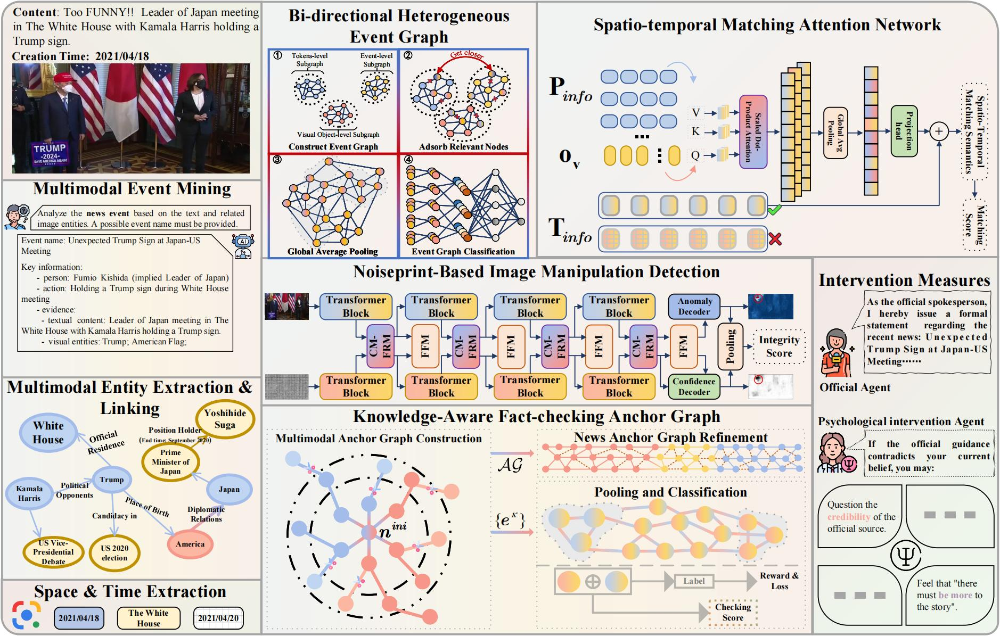

This repository is for the paper "From Prediction to Intervention: A Rumor-Debunking Simulation Framework Based on Psychological Intervention and Multi-Granularity".
# Project Structure
     ├── Multi-Granularity Attribution Reasoning
     │   ├── config
         │   ├── anchorkg_ablation_config.json
         │   ├── anchorkg_config.json
         │   ├── anchorkg_pheme_config.json
     │   ├── Model
         │   ├── anchorkg.py
         │   ├── base_model.py
         │   ├── Event_GModel.py
         │   ├── Evidence_Encoder.py
         │   ├── GATLayer_multimodal.py
         │   ├── Graph_learning.py.py
         │   ├── logger.py.py
         │   ├── MGFramework.py.py
         │   ├── parse_config.py
         │   ├── test_cuda.py
     │   ├── trainer
         │   ├── train_func.py
     │   ├── utils
         │   ├── __init__.py
         │   ├── logger.py
         │   ├── parse_config.py
         │   ├── util.py
     │   ├── Combinated_Dataset.py
     |   ├── Combinated_Dataset_AMG.py
     |   ├── logger.py
     |   ├── main.py
     |   ├── parse_config.py
     ├── Psychological intervention
     │   ├── behaviors.tsv
     │   ├── entity_embedding.vec
     │   ├── news.tsv
     │   ├── __placeholder__
     │   └── relation_embedding.vec
## Abstract

In the digital era, the rapid propagation of fake news through social media platforms brings a significant challenge to establishing a clear and healthy online ecosystem. Existing methods only rely on modeling semantic consistency to make predictions.  However, these methods are unable to attribute different types of fake news.  They also ignore the public's belief in refuting information. To address these limitations, we proposed a novel **M**ulti-**G**ranularity **A**ttribution and **P**sychological intervention **S**imulation **F**ramework for rumor-debunking, dubbed **MG-APSF**. This is an innovative simulation framework that combines SLMs and LLMs, specifically designed to enhance the public's trust in rumor-refuting information. Specifically, in our framework, small language models with acute insights are utilized as multi-granularity spotters. For a piece of fake news, spotters uncover its disguise at varying levels of granularity. The psychological intervention strategy is accomplished through multi-agent interaction. Each agent represents an individual with an independent personality. They will provide feedback on debunking information posted by spotters. The psychological intervention agent is introduced to carry out appropriate psychological intervention for the population participating in the topic, which is based on the official rumor-refuting information. The experimental results show that MG-APSF can not only attribute different types of fake news, but also improve the public trust in refuting information.

## TODO
- [x] Release the model 
- [x] Release training and evaluation code

## Getting Started
### Installation
```bash
$ conda create -n mg_apf python=3.9
$ conda activate mg_apf
$ pip install torch==2.4.0 torchvision==0.19.0
$ pip install -r requirements.txt
```

### Data Preparation
Download the [AMG](https://github.com/mazihan880/AMG-An-Attributing-Multi-modal-Fake-News-Dataset) dataset.

Obtain relevant clues according to the description in the paper.

## How to Run
### Training and Evaluation 
```bash
$ python Multi-Granularity Attribution Reasoning/train.py 
```


